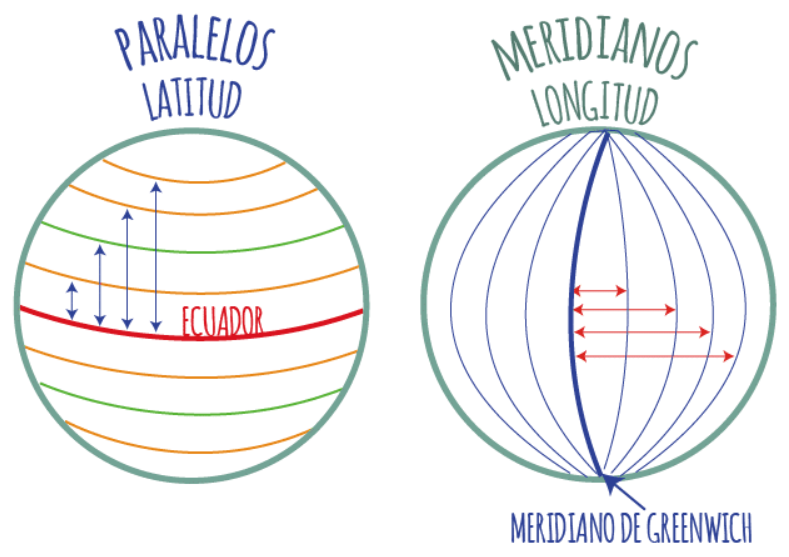
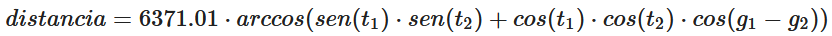

# PC1: Práctica Calificada  
**course:** Programación II  
**unit:** 1 y 2  
**cmake project:** prog2_pc1_lab102_v2021_2

## Indicaciones Específicas
- El tiempo límite para la evaluación es 100 minutos.
- Cada pregunta deberá ser respondida en un archivo fuente (`.cpp`) y un archivo cabecera (`.h`) con el número de la pregunta:
    - `p1.cpp, p1.h`
    - `p2.cpp, p2.h`
    - `p3.cpp, p3.h`
- Deberás subir estos archivos directamente a [www.gradescope.com](https://www.gradescope.com) o se puede crear un `.zip` que contenga todos ellos y subirlo.

## Competencias
- Para los alumnos de la carrera de Ciencia de la Computación
    - Aplica conocimientos de computación  apropiados para la solución de problemas definidos y sus requerimientos en la disciplina del programa.(nivel 2)
    - Diseña, implementa y evalúa soluciones a problemas complejos de computación.(nivel 2)
    - Crea, selecciona, adapta y aplica técnicas, recursos y herramientas modernas para la práctica de la computación y comprende sus limitaciones.(nivel 2)

- Para los alumnos de las carreras de Ingeniería
    - Capacidad para aplicar conocimientos de matemática.(nivel 2)
    - Capacidad para diseñar un sistema, un componente o un proceso para satisfacer las necesidades deseadas dentro de restricciones realistas(nivel 2)

### Pregunta #1 - Estructuras de control - Arrastrando digito (7 points)
Escribir un programa que lea 2 números que tengan la misma cantidad de dígitos y que muestre la cantidad de veces en que la suma de dos de sus dígitos arrastra un dígito a izquierda, cuando se suman los dos números.  

Ejemplos:
```markdown
Si a = 37 y b = 38 la respuesta es 1 
ya que solo 7 + 8 arrastra un digito a la izquierda

Si a = 6717 y b = 4536 la respuesta es 3 
ya que 7 + 6, 6 + 5 y 6 + 4 arrastran un digito a la izquierda
```

#### Input Format
```cpp
37
38
```

#### Constraints
```cpp
- El ingreso de los valores no requiere utilizar etiquetas (std::cout)
```

#### Output Format
```cpp
1
```
#### Ejemplo 1
**Input**
```cpp
345
715
```
**Output**
```cpp
2
```

#### Ejemplo 2
**Input**
```cpp
65185
57195
```
**Output**
```cpp
4
```

#### Ejemplo 3
**Input**
```cpp
11
11
```
**Output**
```cpp
0
```
123456789
### Pregunta #2 - función - 3st4 3s 2n4 f2nc10n (6 points)

Escribir la función `encriptar_texto` que reciba un texto y que retorne el texto convirtiendo las vocales por las siguientes equivalencias:

```markdown
- 'a', 'A' --> '4'
- 'e', 'E' --> '3'
- 'i', 'I' --> '1'
- 'o', 'O' --> '0'
- 'u', 'U' --> '2'
```
La cabecera de la función debe ser:
```cpp
string encriptar_texto(string texto);
```
**NOTA:**  
Para leer un texto con espacios en blanco utilizar `std::getline` que se encuentra en `#include <string>`. Ejemplo:
```cpp
string texto;
getline (cin, texto); // Utilizarlo en vez de cin >> texto;
```

#### Input Format
```cpp
Hola Mundo
```

#### Constraints
```cpp
- El ingreso de los valores no requiere utilizar etiquetas (std::cout)
```

#### Output Format
```cpp
H0l4 M2nd0
```
#### Ejemplo 1
**Input**
```cpp
Ciencias de la Computacion
```
**Output**
```cpp
C13nc14s d3 l4 C0mp2t4c10n
```

#### Ejemplo 2
**Input**
```cpp
Universidad de Ingenieria y Tecnologia - UTEC
```
**Output**
```cpp
2n1v3rs1d4d d3 1ng3n13r14 y T3cn0l0g14 - 2T3C
```

### Pregunta #3 - Distancia Terrestre (7 points)

La superficie de la Tierra es curva y la distancia entre 2 longitudes varía con la latitud, por lo que encontrar la distancia entre 2 puntos es más complicado que simplemente usar el teorema de Pitágoras.



Dados  que son la latitud y longitud de 2 puntos en la Tierra. La distancia entre ambos puntos en kilómetros se calcula.

donde:  
`6371.01` es el radio de la tierra en kilómetros.

Escribir la funcion `calcular_distancia` que solicite la latitud y longitud de 2 puntos en la tierra y que muestre la distancia entre los puntos.

La cabecera de la función debe ser:
```cpp
double calcular_distancia(double t1, double g1, double t2, double g2);
// donde:
// t1, g1 son la latitud y longitud de un primer punto en la tierra
// t2, g2 son la latitud y longitud de un primer punto en la tierra
```
#### Input Format
```cpp
-12.0464     // Lima
-77.0428
-5.1783      // Piura
-80.6549
```

#### Constraints
```cpp
- El ingreso de los valores no requiere utilizar etiquetas (std::cout)
```
#### Output Format
```cpp
860.66
```
#### Ejemplo 1
**Input**
```cpp
-5.1783
-80.6549
-18.0203
-70.3321
```
**Output**
```cpp
1815.84
```
